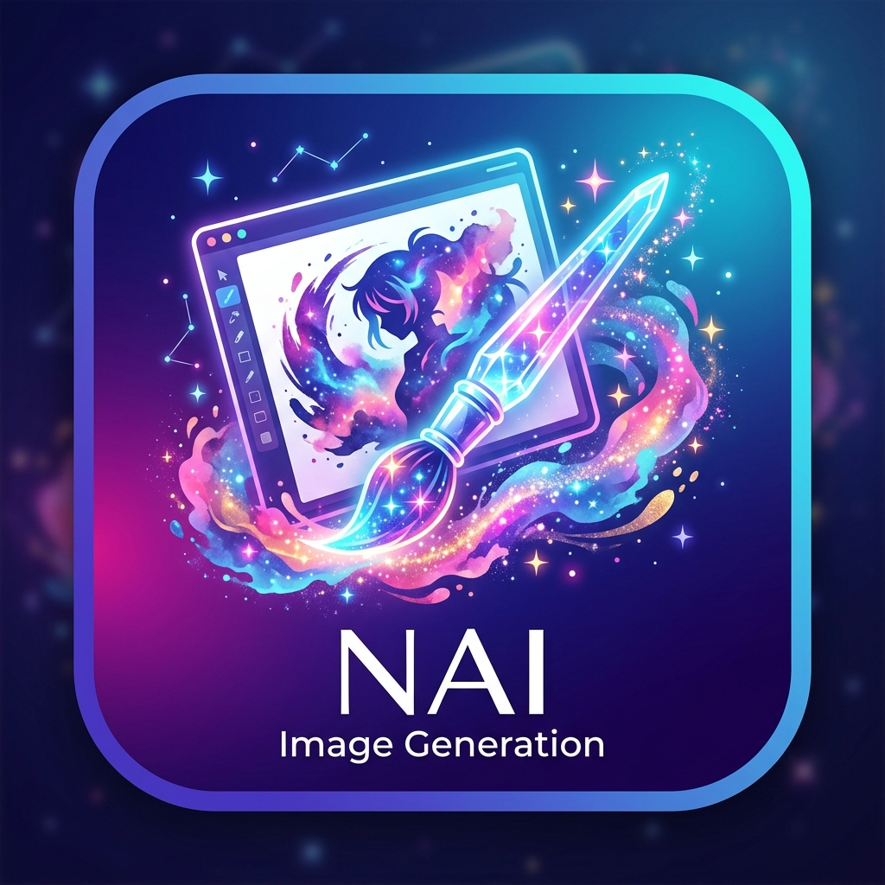

<p align="center">
  
</p>

<h1 align="center">astrbot_plugin_nai</h1>

<p align="center">
  <strong>基于 Nai2API 网关的高性能 NovelAI 文生图 AstrBot 插件</strong>
</p>

<p align="center">
  <a href="./LICENSE"></a>
  <a href="https://github.com/AstrBotDevs/AstrBot">=4.0.0-purple.svg" alt="AstrBot Version"></a>
  
  
</p>

---

## 📖 简介

`astrbot_plugin_nai` 是专为 [AstrBot](https://github.com/AstrBotDevs/AstrBot) 打造的 NovelAI 文生图插件。通过 [nai.sta1n.cn](https://nai.sta1n.cn)（Nai2API）提供的异步生图网关，支持多种指令模式、内置双套精选画风预设包、LLM 参数智能提取与创作扩写，并深度集成大模型工具调用（Function Calling）能力。

---

## ✨ 核心特性

- 🚀 **多样化生图指令**：
  - `/nai`：直接出图，支持即时指定尺寸、画风、采样器、步数、CFG 与负面提示词。
  - `/nai2`：LLM 智能参数提取，将中文精准**直译**为英文 Tag，忠于原意不擅自脑补。
  - `/nai3`：LLM 创作型提示词生成，基于内置提示词系统引导，生成极具视觉表现力的高质量 Tag 串。
- 🤖 **LLM 工具自动调用**：
  - 注册 `nai_generate_image` 工具函数，主对话大模型能够自动理解用户绘图需求并调用出图，免敲指令丝滑交互。
- 🎨 **双套画风预设系统**：
  - 支持 `doc712`（强化前缀串）与 `website`（官网动态串）两套画风包，包含 `galgame`、`fresh`、`2.5d`、`comicDoujin` 等多种风格，并支持跨包别名自动兼容。
- 💬 **多层级消息展示模式**：
  - `verbose` 模式：详尽展示任务提交、排队进度、图片与元信息。
  - `compact` 模式：仅发送「开始提示」、「图片展示」与可选的「参数详情」，OneBot v11 群聊更支持合并转发。
- 🛡️ **安全隔离与稳定性**：
  - 严格的 Style 隔离与前缀防护，避免历史会话画师污染。
  - 2K/4K 超大分辨率防误触点数熔断保护。

---

## 🛠️ 安装方法

### 方式一：WebUI 插件市场安装（推荐）

1. 进入 AstrBot 管理面板，点击左侧导航栏的 **插件管理**。
2. 切换至 **插件市场**，搜索 `astrbot_plugin_nai` 或 `NAI 生图`。
3. 点击 **安装**，安装完成后在插件列表中点击 **启用** 并 **重载**。

### 方式二：Git Clone 安装

进入 AstrBot 根目录下的插件文件夹执行克隆：

```bash
cd AstrBot/data/plugins
git clone https://github.com/the-snowpear/astrbot_plugin_nai.git
```

重启 AstrBot 或在 WebUI 重新加载插件。

---

## ⚙️ 配置说明

安装后在 AstrBot WebUI 的插件配置页面中填入以下信息：

| 配置项 | 类型 | 默认值 | 说明 |
| :--- | :--- | :--- | :--- |
| `api_key` | string | `""` | **必填**。Nai2API 密钥（在 [nai.sta1n.cn](https://nai.sta1n.cn) 获取，格式如 `STA1N-...`） |
| `base_url` | string | `https://nai.sta1n.cn` | Nai2API 网关接口地址 |
| `style_pack` | string | `doc712` | 画风包选择：`doc712`（文档增强串） / `website`（官网串） |
| `default_style` | string | `none` | 默认画风 ID。设为 `none` 时不注入画师前缀 |
| `default_size` | string | `竖图` | 默认图片规格（竖图 / 横图 / 方图 / 2K* / 4K*） |
| `model` | string | `nai-diffusion-4-5-full` | 生图模型代号 |
| `steps` | number | `28` | 默认生成步数 |
| `scale` | number | `5.0` | 提示词引导系数 (Prompt Guidance) |
| `cfg` | number | `0.0` | CFG Rescale 系数 |
| `sampler` | string | `k_dpmpp_2m_sde` | 采样器算法 |
| `allow_2k` / `allow_4k` | boolean | `false` | 是否允许生成 2K/4K 规格（防止误消耗大额点数） |
| `message_mode` | string | `verbose` | 消息反馈模式：`verbose`（详细轮询） / `compact`（紧凑三次输出） |
| `compact_send_details` | boolean | `true` | 紧凑模式下是否发送参数卡片（群聊自动合并转发） |
| `enable_llm_tool` | boolean | `true` | 是否允许主会话 LLM 自动识别意图并调用生图 |
| `llm_base_url` / `llm_api_key` / `llm_model` | string | `""` | 独立 OpenAI 兼容大模型接口（留空则回退使用 AstrBot Provider） |

---

## 🎮 指令速查

### 1. `/nai` 直出指令

使用配置页的默认参数快速生成图片，支持行内覆盖各项参数：

```bash
# 基础生成
/nai 1girl, silver hair, blue eyes, looking at viewer

# 指定画风与尺寸
/nai 2K竖图 forest cabin, glowing lanterns --style galgame

# 覆盖高级采样与负面词
/nai masterpiece, starry sky --sampler k_euler --steps 32 --negative lowres, blurry
```

### 2. `/nai 画风` & `/nai 余额`

```bash
/nai 画风    # 查看当前画风包内所有可用风格 ID 与画风说明
/nai 余额    # 快速查询当前 Nai2API 账户的剩余点数
```

### 3. `/nai2` 智能参数提取（直译）

将用户的中文描述精准直译为动漫 Tag，并提取显式指定的风格和尺寸：

```bash
/nai2 画一个戴着红围巾、在雪地里微笑的银发少女，横图，画风galgame
```

### 4. `/nai3` 创作型深度扩写

根据引导系统，将灵感扩写为极具画面感的完整提示词组合：

```bash
/nai3 废土赛博都市，雨夜，机械义肢少女坐在霓虹广告牌边缘
```

### 5. 自然语言对话生图 (LLM Tool)

在群聊或私聊中直接与机器人对话，开启 `enable_llm_tool` 后，机器人能够自动领会并触发绘图：
> **用户**：“帮我画一张二次元风格的星空水彩插画”  
> **机器人**：*(自动调用后台接口并推送精美成品图片)*

---

## 🎨 画风与尺寸对照

### 画风 ID 概览

| 风格 ID | 风格特色 | 适用画风包 |
| :--- | :--- | :--- |
| `fresh` | 清新通透、高亮光影与精细色彩 | `website` / `doc712` |
| `galgame` | 美少女游戏立绘、赛璐璐与柔和立绘质感 | `website` / `doc712` |
| `2.5d` | 介于二次元与写实之间的厚涂光影 | `website` / `doc712` |
| `comicDoujin` | 黑白/网点漫画质感与张力分镜感 | `website` / `doc712` |
| `doujin` | 现代同人展精致插画风 | `website` / `doc712` |
| `animeOld` | 80/90 年代复古赛璐璐动画风格 | `doc712` |
| `realistic_loli` / `lolita25d` | 娃娃质感半写实风格（双包相互别名映射） | 跨包支持 |

### 规格与点数消耗

| 尺寸名称 | 分辨率等效 | 点数消耗 |
| :--- | :--- | :--- |
| 竖图 / 横图 / 方图 | 标准规格 (832×1216 / 1216×832 / 1024×1024) | 1 点 |
| 2K竖图 / 2K横图 / 2K方图 | 2K 超清扩展规格 | 15 点 |
| 4K竖图 / 4K横图 / 4K方图 | 4K 顶级旗舰规格 | 25 点 |

---

## 📁 目录结构

本项目严格遵循 AstrBot 官方单层插件组织规范：

```text
astrbot_plugin_nai/
├── .gitignore              # Git 忽略配置
├── LICENSE                 # MIT 开源许可证
├── README.md               # 插件使用文档
├── CHANGELOG.md            # 版本变更日志
├── CONTRIBUTING.md         # 贡献与开发规范
├── _conf_schema.json       # AstrBot WebUI 配置项元数据
├── metadata.yaml           # AstrBot 插件元数据声明
├── requirements.txt        # Python 依赖清单
├── logo.png                # 插件官方 1:1 视觉图标
├── main.py                 # 插件主逻辑与 AstrBot Star 入口
├── nai_client.py           # Nai2API 异步客户端 (Job 调度与轮询)
├── llm_helper.py           # LLM 工具与提示词处理
├── styles.py               # 画风包与尺寸映射表
├── prompts/                # 内置提示词系统模板
│   ├── nai2_system.txt     # /nai2 直译系统提示词
│   └── nai3_system.txt     # /nai3 创作扩写系统提示词
└── tests/                  # 自动化回归测试套件
    └── test_prompt_decontamination.py
```

---

## 🧪 自动化测试

运行内置完整回归测试集：

```bash
python -m unittest discover tests
```

---

## 🤝 贡献与反馈

- 如遇问题或功能建议，欢迎提交 [GitHub Issues](https://github.com/the-snowpear/astrbot_plugin_nai/issues)。
- 代码贡献请参考 [CONTRIBUTING.md](./CONTRIBUTING.md)。

---

## 📄 开源许可证

本项目基于 [MIT License](./LICENSE) 协议开源。
